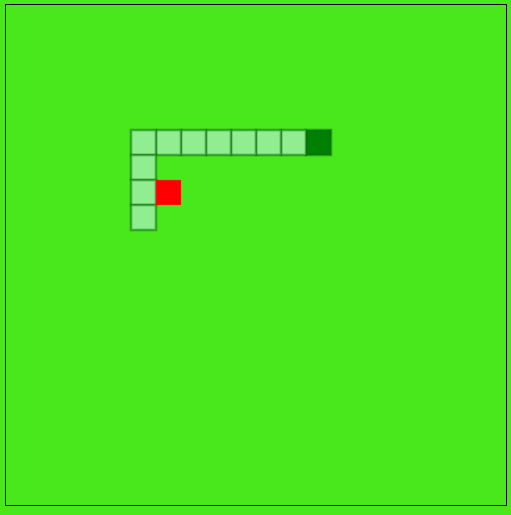

#Snake Game JavaScript

A classic Snake game built using JavaScript as part of my learning journey in web development.

##Features

- Classic snake movement
- Food generation system
- Score tracking
- Game over detection
- Keyboard controls

##Tech Stack

- HTML
- CSS
- JavaScript (Vanilla JS)

##Purpose

This project was created to practice:

- Game loop logic
- Keyboard input handling
- Collision detection
- Dynamic rendering using JavaScript

##How to Run

1. Clone or download this repository
2. Open
3. Use arrow keys to control the snake

##Screenshot

##What I Learned

- Implementing game loop in JavaScript
- Handling real-time user input
- Managing game state
- Basic algorithm for movement and collision

##Future Improvements

- Add levels or difficulty
- Add sound effects
- Improve UI design
- Add mobile support

##Author

Agung Wahidin Saputra  
Software Engineering Student | Aspiring AI & Developer
